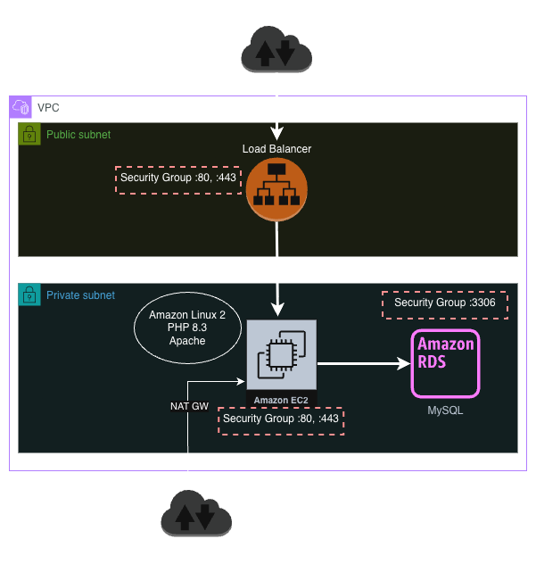
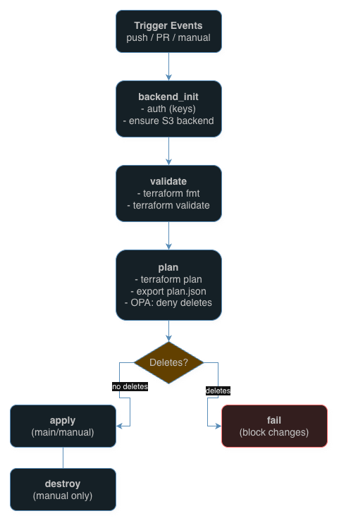

# Architecture Decision Record

## Context
This ADR documents the architecture of a scalable LAMP (Linux, Apache, MySQL, PHP) web application deployed on AWS using Terraform, designed as a proof-of-concept (PoC) for a technical assessment. the architecture prioritizes automation, security, and operational resilience. This document details technical decisions, justifies choices with trade-offs, and proposes improvements to enhance scalability, security, and performance.

## Architecture Diagram



The architecture diagram illustrates a VPC with two public subnets hosting an Application Load Balancer (ALB) and two private subnets hosting Amazon Linux 2 EC2 instances and an RDS MySQL database. An Internet Gateway enables public access to the ALB, while a NAT Gateway routes outbound traffic from private subnets. Arrows depict HTTP/HTTPS traffic flow from the ALB to EC2 instances and MySQL connections to RDS.

## Network
### Configuration
- **VPC**: Deployed using `terraform-aws-modules/vpc/aws` (v6.5.0).
  - CIDR: `10.0.0.0/16`.
  - Subnets:
    - Public: `10.0.1.0/24` (eu-central-1a), `10.0.2.0/24` (eu-central-1b).
    - Private: `10.0.3.0/24` (eu-central-1a), `10.0.20.0/24` (eu-central-1b).
  - Internet Gateway for public subnets; single NAT Gateway in `eu-central-1a` for private subnets outbound traffic.
- **Decision Rationale**: Two Availability Zone balances cost (~$32/month for NAT Gateway) and availability for PoC application. Single NAT Gateway reduces costs but introduces a single point of failure.

### Improvements
- Extend to three AZs (e.g., eu-central-1a, eu-central-1b and eu-central-1c) with separate public and private subnets to reduce outage risk.
- Deploy one NAT Gateway per AZ (~$96/month total) to eliminate single points of failure.
- Consider replicating the VPC in another region (e.g., eu-central-2) for multi-region disaster recovery.

## Security
### Configuration
- **Security Groups**:
  - **ALB SG**: Inbound HTTP(80), HTTPS(443) from `0.0.0.0/0`; Outbound to Web Server SG on HTTP(80), HTTPS(443).
  - **EC2 SG**: Inbound HTTP(80) from ALB SG; Outbound to RDS SG on MySQL(3306) and Secrets Manager.
  - **Database SG**: Inbound MySQL(3306) from Web Server SG; no outbound rules.
- **IAM**:
  - Dedicated roles for EC2 instances with least-privilege policies for SSM, Secrets Manager, and CloudWatch Logs access.
  - KMS key for encrypting Secrets Manager credentials.
- **Decision Rationale**: Least-privilege security groups minimize attack surface. SSM enables secure instance management without SSH. KMS encryption supports compliance with GDPR and HIPAA.

### Improvements
- Restrict ALB SG outbound to Web Server SG only, reducing exposure.
- Deploy CloudFront with AWS WAF (SQL injection, XSS rules) to block malicious requests, caching static content to deliver better performance.
- Use AWS Certificate Manager (ACM) for automated SSL/TLS certificate management.
- Enable AWS Config and Security Hub to monitor compliance with CIS AWS Benchmarks.
- Activate AWS Shield Standard for DDoS protection; consider Shield Advanced for critical workloads.

## Compute Architecture
### Configuration
- **EC2**: `t3.micro` instances running Amazon Linux 2 in private subnets, hosting Apache 2.4 and PHP 8.3.
- **ALB**: Deployed in public subnets, forwarding traffic to EC2 over HTTP(80). Health check on `/health.php` (200 OK response).
- **Decision Rationale**: `t3.micro` is cost-effective for low-traffic workloads. Amazon Linux 2 provides a lightweight, AWS-optimized OS.

### Improvements
- Use a golden AMI with pre-installed Apache, PHP 8.3 and security patches, deployed via pipeline for consistency.
- Implement an Auto Scaling Group (min: 2, max: 4 instances) scaling on CPU > 70% for 5 minutes, supports meeting a 99.9% service SLO.
- Migrate to ECS Fargate for serverless compute, reducing management overhead by 50% and enabling zero-downtime deployments.

## Database Architecture
### Configuration
- **RDS MySQL**:
  - Engine: MySQL 8.0.35.
  - Instance: `db.t3.micro` (1 vCPU, 1GB RAM).
  - Storage: 20GB gp3, auto-scaling to 100GB.
  - Backup: 7-day retention, encrypted with KMS.
  - Security: Hosted in private subnets, access restricted to Web Server SG, SSL-enabled connections, credentials in Secrets Manager.
- **Decision Rationale**: `db.t3.micro` ($16/month) suits small-scale.

### Improvements
- Upgrade to `db.t4g.small` (Graviton, ~10% cost savings) and enable Auto Minor Version Upgrade.
- Use Multi-AZ DB Cluster, improving HA.
- Enable Performance Insights (7-day retention) and slow query logs (>1s) to CloudWatch for query optimization.
- Schedule cross-Region snapshot copies to `eu-central-2` and test restores quarterly.
- Set CloudWatch alarms for CPU > 80%, connections > 50, and replica lag > 30s.

## Application Architecture
### Web Server Stack
```
┌────────────────────┐
│   Apache HTTP      │
│   Server 2.4       │
├────────────────────┤
│   PHP 8.3          │
│   (opcache, MySQL  │
│    extension)      │
├────────────────────┤
│   Amazon Linux 2   │
└────────────────────┘
```

### Application Components
- **Homepage**: Static HTML displaying system status (e.g., uptime, user count).
- **Health Check**: JSON endpoint (`/health.php`) for ALB health checks, returning status and uptime.

### Improvements
- Containerize application using Docker for portability across ECS/EKS.

## Monitoring and Logging
### Configuration
- **CloudWatch Agent**: Installed on EC2 instances to publish **memory**, **disk**, **filesystem**, and **application log** metrics not available by default.
- **CloudWatch Integration**:
  - **EC2**: CPUUtilization (native), MemoryUtilization, DiskUsage, FilesystemUsage (via CloudWatch Agent).
  - **RDS**: Database connections, CPU, replica lag.
  - **ALB**: Request count, latency, 4xx/5xx errors.
  - **Logs**: Application logs to CloudWatch Logs via agent.
- **Decision Rationale**: CloudWatch provides centralized monitoring for AWS resources, enabling real-time insights.

### Improvements
- Create a CloudWatch Dashboard for CPU, latency, and error metrics, improving visibility.
- Set alarms (e.g., ALB 5xx errors > 5/min, RDS CPU > 80%) with PagerDuty integration for 24/7 alerts.
- Retain logs for 30 days, balancing cost and compliance.
- Use CloudWatch Metrics Insights for custom queries (e.g., “top 5 slow queries”).

## Disaster Recovery
### Configuration
- **Database**: Automated RDS backups with 7-day retention.
- **Infrastructure**: Terraform state in S3 (`s3://tf-state-bucket`) with versioning and DynamoDB locking.
- **Application**: Redeploy via user data script in EC2.
- **Decision Rationale**: S3 state management ensures infrastructure recovery; RDS backups support point-in-time recovery.

### Improvements
- Replicate Terraform state to `eu-central-2` S3 bucket for cross-region DR.
- Conduct quarterly DR drills to validate `terraform apply` and RDS restore within 90 minutes.

## CI/CD Workflow


The CI/CD pipeline automates Terraform deployments:
- **Trigger Events**: Push, pull request, or manual trigger.
- **Steps**:
  - Backend initialization (S3 authentication, keys).
  - `terraform fmt` and `terraform validate` for code quality.
  - `terraform plan`, exporting `plan.json`.
  - OPA policy (`policy/opa/terraform.rego`) to deny deletes.
  - `terraform apply` (main/manual branches).
  - `terraform destroy` (manual only).
- **Decision Rationale**: OPA enforces governance by blocking destructive changes. Local `deploy.sh` script mirrors backend bootstrap for consistency.

### Improvements
- Integrate CI/CD for automated app deployments, reducing manual errors.
- Use GitLab runners deployed on AWS with IAM roles (No need for access keys).